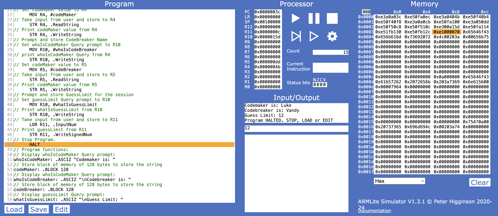
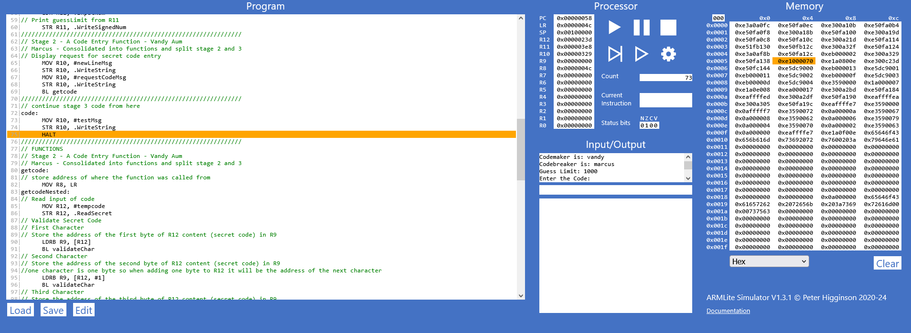
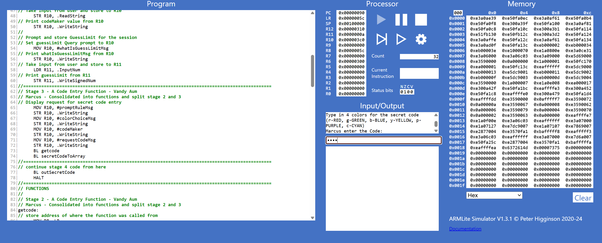
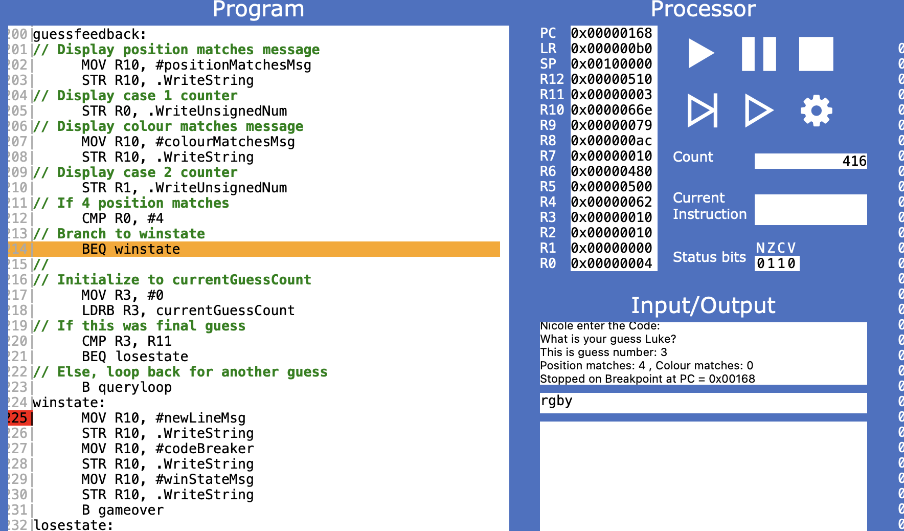

\begin{titlepage}
\begin{center}

\textbf{COS10031 Computer Technology}

\vspace{0.5cm}

\textbf{Assignment 3: ARMLite Mastermind Game}

\vspace{2.5cm}

\textbf{8:30am Tuesday, 10:30am Wednesday}

\textbf{with Dr. Sourabh Dani}

\vspace{2.5cm}

\textbf{Nicole Reichert (100589839)}

\textbf{Marcus Mifsud (105875038)}

\textbf{Vandy Aum (105715697)}

\textbf{Luke Byrnes (7194587)}

\vspace{2.5cm}

Due: 18 May 2025

\textbf{Diploma IT - Swinburne College}

\end{center}
\end{titlepage}

\tableofcontents

# Mastermind Assembly Game

## Program Overview

This program replicates gameplay of the Mastermind boardgame in Assembly using the ARMLite assembly utility.

## Key Functions

### Stage 1 (`stage1.txt`)

Stage 1 makes use of the following functions:

```{.asm filename="Functions of 'stage1.txt'" code-line-numbers="true"}
// Program functions:
    // Display whoIsCodeMaker Query prompt:
    whoIsCodeMakerMsg: .ASCIZ "Codemaker is: "
    // Store block of memory of 128 bytes to store the string
    codeMakerMsg: .BLOCK 128
    // Display whoIsCodeMaker Query prompt:
    whoIsCodeBreakerMsg: .ASCIZ "\nCodebreaker is: "
    // Store block of memory of 128 bytes to store the string
    codeBreakerMsg: .BLOCK 128
    // Display guessLimit Query prompt:
    whatIsGuessLimitMsg: .ASCIZ "\nGuess Limit: "
```

{width="600"}

### Stage 2 (`stage2.txt`)

In stage 2 a function `getcode` was created to receive input of a code and validate that it follows the rules of the game. After receiving input, the value of each character is extracted from the string using `LDRB` before branching to `validateChar` where it is checked against all valid characters. The fifth character of the string is then checked and returns an error if it has any value.

---
stage2.txt
---

```{.asm code-line-numbers="true"}
getcode:
    // store address of where the function was called from
    MOV R8, LR
    getcodeNested:
        // Read input of code
        MOV R12, #tempcode
        STR R12, .ReadString
        // Validate Secret Code
        // First Character
            // Store the address of the first byte of R12 content (secret code) in R9
            LDRB R9, [R12]
            BL validateChar
        // Second Character
            // Store the address of the second byte of R12 content (secret code) in R9
            //one character is one byte so when adding one byte to R12 it will be the address of the next character
            LDRB R9, [R12, #1] 
            BL validateChar
        // Third Character
            // Store the address of the third byte of R12 content (secret code) in R9
            LDRB R9, [R12, #2]
            BL validateChar
        // Fourth Character
            // Store the address of the fourth byte of R12 content (secret code) in R9
            LDRB R9, [R12, #3]
            BL validateChar
        // Fifth Character
            // Store the address of the fifth byte of R12 content (secret code) in R9
            LDRB R9, [R12, #4]
            CMP R9, #0      //check if a character was not entered
            BNE overLimit   //if a character was entered branch to 'overLimit'
        //if a fifth character was not entered and all prior checks passed, input is valid, return to code
        // return address the function was called from to LR
        MOV LR, R8
        B Return
         
invalidChar:
    MOV R10, #errorMsg1
    STR R10, .WriteString
    b getcodeNested
tooFewChar:
    MOV R10, #errorMsg2
    STR R10, .WriteString
    b getcodeNested
overLimit:
    MOV R10, #errorMsg3
    STR R10, .WriteString
    b getcodeNested

// VALIDATE CHARACTER FUNCTION
validateChar:
    CMP R9, #0        //check if a character was not entered
    BEQ tooFewChar
    CMP R9, #0x72     //check if the character is r(red)
    BEQ Return
    CMP R9, #0x67     //check if the character is g(green)
    BEQ Return
    CMP R9, #0x62     //check if the character is b(blue)
    BEQ Return
    CMP R9, #0x79     //check if the character is y(yellow)
    BEQ Return
    CMP R9, #0x70     //check if the character is p(purple)
    BEQ Return
    CMP R9, #0x63     //check if the character is c(cyan)
    BEQ Return
    b invalidChar     //branch to 'invalidChar' if the character was not matched by any of the above checks

// Function to return from function
Return: RET
```

{width="600"}

### Stage 3 (`stage3.txt`)

In stage 3 the 'codeToArray' function was created to convert the string 'tempcode' into an array. The `getcode` function was also modified to utilize `.ReadSecret` the first time it runs (always the code maker's turn) to hide the entered code from the code breaker.

---
codeToArray function of 'stage3.txt'
---

```{.asm code-line-numbers="true"}
// Store code to array function
// R12 - Address to tempcode is stored here
// R9 - Current Character
// R6 - Memory address of the array to fill
// R7 - Array index
secretCodeToArray:
    // load the address of the secret code into R6
    MOV R6, #secretcode
    B codeToArray
codeToArray:
    // initialize the array position to 0
    MOV R7, #0
    fillArrayLoop:
        // divide R7 (index) by 4
        LSR R7, R7, #2
        // load character into R9
        LDRB R9, [R12 + R7]
        // multiply R7 (index) by 4
        LSL R7, R7, #2

        // store character into array element
        STR R9, [R6 + R7]

        // increment index counter by 4
        ADD R7, R7, #4

        CMP R7, #codeArraySize // repeat until 4 elements of the array have been filled
        BLT fillArrayLoop
    B Return
```

---
exert from updated getcode function in 'stage3.txt'
---

```{.asm code-line-numbers="true"}
getcodeNested:
        // Read input of code
        MOV R12, #tempcode
        // Initialize R6
        MOV R6, #0
        MOV R6, #secretcode
        MOV R9, #0
        LDRB R9, [R6]
        CMP R9, #0
        BEQ secretcodeentry
        BNE querycodeentry
        // If codemaker's turn
        secretcodeentry:
            STR R12, .ReadSecret
            B validateCharLoop
        // If codebreaker's turn
        querycodeentry:
            STR R12, .ReadString
            B validateCharLoop
```

{width="600"}

### Stage 4 (`stage4.txt`)

In stage 4 the `queryloop` function was created which increments the guess counter before checking if the code breaker has exceeded the guess limit. If not, the code breaker is requested to enter their guess using the `getcode` function. The code then branches back to the start of `queryloop` and continues looping until the guess limit is met.

---
query loop function
---

```{.asm code-line-numbers="true"}
queryloop:
    // Initialize to currentGuessCount
    MOV R3, #0
    LDRB R3, currentGuessCount
    // Increment guess count by 1
    ADD R3, R3, #1
    STRB R3, currentGuessCount
    // Check if we are at guess limit
    CMP R3, R11
    BGT break
    // reset R3
    MOV R3, #0
    //
    // Continue to guess now that we've checked guess count
    // Print 'What is your guess'
    MOV R10, #requestGuessMsg
    STR R10, .WriteString
    // Print codebreaker name
    MOV R10, #codeBreaker
    STR R10, .WriteString
    // Print question mark
    MOV R10, #questionMarkMsg
    STR R10, .WriteString
    // End line
    MOV R10, #newLineMsg
    STR R10, .WriteString
    //
    // Print 'This is guess number: '
    MOV R10, #guessNumberCountMsg
    STR R10, .WriteString
    // Print guess number
    LDRB R10, currentGuessCount
    STR R10, .WriteUnsignedNum
    // End line
    MOV R10, #newLineMsg
    STR R10, .WriteString
    //
    // Get codebreaker's guess
    BL getcode
    BL queryCodeToArray

    B query
// out of guesses
break:
    HALT
//================================================================================================
// Continue stage 5 here
    query:

        B queryloop
```

{width="600"}

### Stage 5a (`stage5a.txt`)

Stage 5a...

```asm {filename="stage3.txt" code-line-numbers="true"}
1234
```

{width="600"}

### Stage 5b (`stage5b.txt`)

Stage 5b...

```asm {filename="stage5b.txt" code-line-numbers="true"}
1234
```

{width="600"}

## Assumptions

### No restrictions for user submitted Guess Limit

Reasonable number of guesses will be submitted as input for the user without controls. The application does not constrict the user-entry value of the number of guesses to either a numerical entry limit, nor a theoretical mathematical limit of guesses needed to get the right answer. For example, as per the rules of Mastermind, the total sequences available to guess from is expressed by:

$$\text{Total Sequences} = \text{Number of options}^{\text{Number of places}}$$

$$\text{Total Sequences} = 6^{4} = 1296$$

### No Duplicate Guess controls

There are no validation checks for duplicate sequence submissions made by the user. This means that the user is burning an opportunity to guess within the specified limit, but also means that they have increased the number of guesses that could potentially be needed to obtain the correct outcome if there was no limit specified. That is, for each duplicate guess $d$, the number of total sequences increases by 1.

$$
\text{Total guesses required} = \text{Total sequences} + \text{Duplicate Guesses}
$$

$$
\text{Total guesses required} = 1296 + d
$$

## Unresolved Problems

\newpage

## Appendix 1 - Full Code Stack

```asm {filename="mastermind.asm" code-line-numbers="true"}

```
