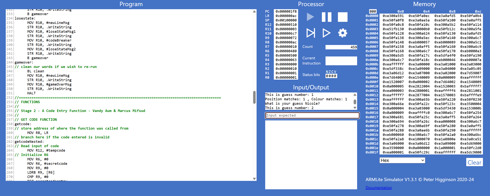
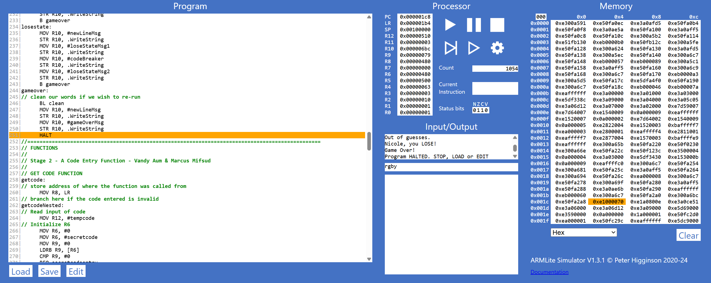

\begin{titlepage}
\begin{center}

\textbf{COS10031 Computer Technology}

\vspace{0.5cm}

\textbf{Assignment 3: ARMLite Mastermind Game}

\vspace{2.5cm}

\textbf{8:30am Tuesday, 10:30am Wednesday}

\textbf{with Dr. Sourabh Dani}

\vspace{2.5cm}

\textbf{Nicole Reichert (100589839)}

\textbf{Marcus Mifsud (105875038)}

\textbf{Vandy Aum (105715697)}

\textbf{Luke Byrnes (7194587)}

\vspace{2.5cm}

Due: 18 May 2025

\textbf{Diploma IT - Swinburne College}

\end{center}
\end{titlepage}

\tableofcontents

# Mastermind Assembly Game

## Program Overview

This program replicates gameplay of the Mastermind boardgame in Assembly using the ARMLite assembly utility.

## Key Functions

### Stage 1 (`stage1.txt`)

Stage 1 makes use of the following functions:

```{.asm filename="Functions of 'stage1.txt'" code-line-numbers="true"}
// Program functions:
    // Display whoIsCodeMaker Query prompt:
    whoIsCodeMakerMsg: .ASCIZ "Codemaker is: "
    // Store block of memory of 128 bytes to store the string
    codeMakerMsg: .BLOCK 128
    // Display whoIsCodeMaker Query prompt:
    whoIsCodeBreakerMsg: .ASCIZ "\nCodebreaker is: "
    // Store block of memory of 128 bytes to store the string
    codeBreakerMsg: .BLOCK 128
    // Display guessLimit Query prompt:
    whatIsGuessLimitMsg: .ASCIZ "\nGuess Limit: "
```

{width="600"}

### Stage 2 (`stage2.txt`)

In stage 2 a function `getcode` was created to receive input of a code and validate that it follows the rules of the game. After receiving input, the value of each character is extracted from the string using `LDRB` before branching to `validateChar` where it is checked against all valid characters. The fifth character of the string is then checked and returns an error if it has any value.

```{.asm filename="stage2.txt" code-line-numbers="true"}
getcode:
    // store address of where the function was called from
    MOV R8, LR
    getcodeNested:
        // Read input of code
        MOV R12, #tempcode
        STR R12, .ReadString
        // Validate Secret Code
        // First Character
            // Store the address of the first byte of R12 content (secret code) in R9
            LDRB R9, [R12]
            BL validateChar
        // Second Character
            // Store the address of the second byte of R12 content (secret code) in R9
            //one character is one byte so when adding one byte to R12 it will be the address of the next character
            LDRB R9, [R12, #1] 
            BL validateChar
        // Third Character
            // Store the address of the third byte of R12 content (secret code) in R9
            LDRB R9, [R12, #2]
            BL validateChar
        // Fourth Character
            // Store the address of the fourth byte of R12 content (secret code) in R9
            LDRB R9, [R12, #3]
            BL validateChar
        // Fifth Character
            // Store the address of the fifth byte of R12 content (secret code) in R9
            LDRB R9, [R12, #4]
            CMP R9, #0      //check if a character was not entered
            BNE overLimit   //if a character was entered branch to 'overLimit'
        //if a fifth character was not entered and all prior checks passed, input is valid, return to code
        // return address the function was called from to LR
        MOV LR, R8
        B Return
         
invalidChar:
    MOV R10, #errorMsg1
    STR R10, .WriteString
    b getcodeNested
tooFewChar:
    MOV R10, #errorMsg2
    STR R10, .WriteString
    b getcodeNested
overLimit:
    MOV R10, #errorMsg3
    STR R10, .WriteString
    b getcodeNested

// VALIDATE CHARACTER FUNCTION
validateChar:
    CMP R9, #0        //check if a character was not entered
    BEQ tooFewChar
    CMP R9, #0x72     //check if the character is r(red)
    BEQ Return
    CMP R9, #0x67     //check if the character is g(green)
    BEQ Return
    CMP R9, #0x62     //check if the character is b(blue)
    BEQ Return
    CMP R9, #0x79     //check if the character is y(yellow)
    BEQ Return
    CMP R9, #0x70     //check if the character is p(purple)
    BEQ Return
    CMP R9, #0x63     //check if the character is c(cyan)
    BEQ Return
    b invalidChar     //branch to 'invalidChar' if the character was not matched by any of the above checks

// Function to return from function
Return: RET
```

{width="600"}

### Stage 3 (`stage3.txt`)

In stage 3 the 'codeToArray' function was created to convert the string 'tempcode' into an array. The `getcode` function was also modified to utilize `.ReadSecret` the first time it runs (always the code maker's turn) to hide the entered code from the code breaker.

```{.asm filename="codeToArray function of 'stage3.txt'" code-line-numbers="true"}
// Store code to array function
// R12 - Address to tempcode is stored here
// R9 - Current Character
// R6 - Memory address of the array to fill
// R7 - Array index
secretCodeToArray:
    // load the address of the secret code into R6
    MOV R6, #secretcode
    B codeToArray
codeToArray:
    // initialize the array position to 0
    MOV R7, #0
    fillArrayLoop:
        // divide R7 (index) by 4
        LSR R7, R7, #2
        // load character into R9
        LDRB R9, [R12 + R7]
        // multiply R7 (index) by 4
        LSL R7, R7, #2

        // store character into array element
        STR R9, [R6 + R7]

        // increment index counter by 4
        ADD R7, R7, #4

        CMP R7, #codeArraySize // repeat until 4 elements of the array have been filled
        BLT fillArrayLoop
    B Return
```

```{.asm filename="exert from updated getcode function in 'stage3.txt'" code-line-numbers="true"}
getcodeNested:
        // Read input of code
        MOV R12, #tempcode
        // Initialize R6
        MOV R6, #0
        MOV R6, #secretcode
        MOV R9, #0
        LDRB R9, [R6]
        CMP R9, #0
        BEQ secretcodeentry
        BNE querycodeentry
        // If codemaker's turn
        secretcodeentry:
            STR R12, .ReadSecret
            B validateCharLoop
        // If codebreaker's turn
        querycodeentry:
            STR R12, .ReadString
            B validateCharLoop
```

{width="600"}

### Stage 4 (`stage4.txt`)

In stage 4 the `queryloop` function was created which increments the guess counter before checking if the code breaker has exceeded the guess limit. If not, the code breaker is requested to enter their guess using the `getcode` function. The code then branches back to the start of `queryloop` and continues looping until the guess limit is met.

```{.asm filename="query loop function" code-line-numbers="true"}
queryloop:
    // Initialize to currentGuessCount
    MOV R3, #0
    LDRB R3, currentGuessCount
    // Increment guess count by 1
    ADD R3, R3, #1
    STRB R3, currentGuessCount
    // Check if we are at guess limit
    CMP R3, R11
    BGT break
    // reset R3
    MOV R3, #0
    //
    // Continue to guess now that we've checked guess count
    // Print 'What is your guess'
    MOV R10, #requestGuessMsg
    STR R10, .WriteString
    // Print codebreaker name
    MOV R10, #codeBreaker
    STR R10, .WriteString
    // Print question mark
    MOV R10, #questionMarkMsg
    STR R10, .WriteString
    // End line
    MOV R10, #newLineMsg
    STR R10, .WriteString
    //
    // Print 'This is guess number: '
    MOV R10, #guessNumberCountMsg
    STR R10, .WriteString
    // Print guess number
    LDRB R10, currentGuessCount
    STR R10, .WriteUnsignedNum
    // End line
    MOV R10, #newLineMsg
    STR R10, .WriteString
    //
    // Get codebreaker's guess
    BL getcode
    BL queryCodeToArray

    B query
// out of guesses
break:
    HALT
//================================================================================================
// Continue stage 5 here
    query:

        B queryloop
```

{width="600"}

### Stage 5a (`stage5a.txt`)

In stage 5 the `comparecodes` function was created, it utilizes a main loop for each character of the query code and a nested loop for each character of the secret code testing for case 2.

```{.asm filename="compare codes function" code-line-numbers="true"}
comparecodes:
    // Initializing registers
    MOV R0, #0  // Case 1 Counter
    MOV R1, #0  // Case 2 Counter
    MOV R3, #0
    LDRB R3, arraySize // Array Size
    MOV R9, #0  // Query character
    MOV R4, #0  // Secret character
    MOV R5, #querycode  // Query array address
    MOV R6, #secretcode  // Secret array address
    MOV R7, #0  // array index / loop counter
    // R2 - Inner index

    // Case 1
    case1start:
        // initialize R2 (inner index)
        MOV R2, #0
        // Load a char from query code into R9
        LDRB R9, [R5 + R7]
        //
        // Load a char from secret code into R4
        LDRB R4, [R6 + R7]
        //
        // Compare for Case 1 (BEQ)
        CMP R4, R9
        // If case 1 is true
        BEQ case1true
        // If case 1 is false
        B case2start

    // Case 2
    case2start:
        // if main index = inner index, skip case2 check
        CMP R2, R7
        BEQ case2loopback
        // load secret char
        LDRB R4, [R6 + R2]
        // Compare secret char to query char
        CMP R4, R9
        // if case 2 is true
        BEQ case2true
        //
        // branch here to skip comparison of chars already done in case 1
        case2loopback:
        // increment inner index
        ADD R2, R2, #4

        // loop until full array checked
        CMP R2, R3
        BLT case2start
        B charQueryEnd
    
    ///////////////////////////////////////////////////////////
    // Case 1 success
    // Query char matches secret char in same position
    case1true:
        // Add 1 to case1 counter
        ADD R0, R0, #1
        B case2start
        

    // Case 2 success
    // Query char matches a secret char in a different position
    case2true:
        // Add 1 to case2 counter
        ADD R1, R1, #1
        // go back to case 2 start
        B case2loopback

    // Loop back to main
    charQueryEnd:
        // Add 4 to main index
        ADD R7, R7, #4
        // Have we hit end of loop?
        CMP R7, R3
        // if not, loop back to start of char checks
        BLT case1start
        // if loop complete, display char check info
        B guessfeedback
```

{width="600"}

### Stage 5b (`stage5b.txt`)

In stage 5 the `guessfeedback` function was created which displays the result of `comparecodes`. If the result of case 1 is 4 (the codes fully match) the code branches to `winstate` which display's a win message and then branches to `gameover` which ends the game. The logic for incrementing the current guess count and checking the guess limit was also moved from the start of `queryloop` to the end of `guessfeedback` and branches to `losestate` if the guess limit has been exceeded without a full code match. If the code breaker neither wins or loses at this point, the code loops back to the start of `queryloop` to allow another guess.

```{.asm filename="guess feedback function" code-line-numbers="true"}
guessfeedback:
    // Display position matches message
    MOV R10, #positionMatchesMsg
    STR R10, .WriteString
    // Display case 1 counter
    STR R0, .WriteUnsignedNum
    // Display colour matches message
    MOV R10, #colourMatchesMsg
    STR R10, .WriteString
    // Display case 2 counter
    STR R1, .WriteUnsignedNum
    // If 4 position matches
    CMP R0, #4
    // Branch to winstate
    BEQ winstate
    //
    // Initialize to currentGuessCount
    MOV R3, #0
    LDRB R3, currentGuessCount
    // If this was final guess
    CMP R3, R11
    BEQ losestate
    // Else, loop back for another guess
    B queryloop

    winstate:
        MOV R10, #newLineMsg
        STR R10, .WriteString
        MOV R10, #winStateMsg1
        STR R10, .WriteString
        MOV R10, #codeBreaker
        STR R10, .WriteString
        MOV R10, #winStateMsg2
        STR R10, .WriteString
        B gameover

    losestate:
        MOV R10, #newLineMsg
        STR R10, .WriteString
        MOV R10, #loseStateMsg1
        STR R10, .WriteString
        MOV R10, #codeBreaker
        STR R10, .WriteString
        MOV R10, #loseStateMsg2
        STR R10, .WriteString
        B gameover

    gameover:
        // clean our words if we wish to re-run
        BL clean
        MOV R10, #newLineMsg
        STR R10, .WriteString
        MOV R10, #gameOverMsg
        STR R10, .WriteString
        HALT
```

{width="600"}

{width="600"}

## Assumptions

### No restrictions for user submitted Guess Limit

Reasonable number of guesses will be submitted as input for the user without controls. The application does not constrict the user-entry value of the number of guesses to either a numerical entry limit, nor a theoretical mathematical limit of guesses needed to get the right answer. For example, as per the rules of Mastermind, the total sequences available to guess from is expressed by:

$$\text{Total Sequences} = \text{Number of options}^{\text{Number of places}}$$

$$\text{Total Sequences} = 6^{4} = 1296$$

### No Duplicate Guess controls

There are no validation checks for duplicate sequence submissions made by the user. This means that the user is burning an opportunity to guess within the specified limit, but also means that they have increased the number of guesses that could potentially be needed to obtain the correct outcome if there was no limit specified. That is, for each duplicate guess $d$, the number of total sequences increases by 1.

$$
\text{Total guesses required} = \text{Total sequences} + \text{Duplicate Guesses}
$$

$$
\text{Total guesses required} = 1296 + d
$$

## Unresolved Problems

\newpage

## Appendix 1 - Full Code Stack

```{.asm filename="mastermind.asm" code-line-numbers="true"}
//================================================================================================
// COS10031 - Computer Technology | Assessment 3
// Vandy Aum, Marcus Mifsud, Nicole Reichert, Luke Byrnes
//  ___  ___          _                      _           _ 
//  |  \/  |         | |                    (_)         | |
//  | .  . | __ _ ___| |_ ___ _ __ _ __ ___  _ _ __   __| |
//  | |\/| |/ _` / __| __/ _ \ '__| '_ ` _ \| | '_ \ / _` |
//  | |  | | (_| \__ \ ||  __/ |  | | | | | | | | | | (_| |
//  \_|  |_/\__,_|___/\__\___|_|  |_| |_| |_|_|_| |_|\__,_|                                                  
//
// Register Assignations
    // R0 (Compare Code of Correct Pos/Col)
    // R1 (Compare Code of (Correct Pos, Incorrect Col))
    // R2
    // R3
    // R4 
    // R5 
    // R6
    // R7
    // R8 Function Return (stores LR to return after a function is used within a function)
    // R9 Code character address
    // R10 String Handling
    // R11 Guess Limit
    // R12 Address to temp code
//================================================================================================
// Stage 1 - Game Setup - Luke Byrnes & Nicole Reichert
//
// Prompt and store Codemaker Name
    // Set whoIsCodeMakerMsg Query prompt to R10
    MOV R10, #whoIsCodeMakerMsg
    // print whoIsCodeMakerMsg Query from R10
    STR R10, .WriteString
    // Move codeMaker address to R10
    MOV R10, #codeMaker
    // Take input from user and store to R10
    STR R10, .ReadString
    // Print codeMaker value from R10
    STR R10, .WriteString
//
// Prompt and store CodeBreaker Name
    // Set whoIsCodeMakerMsg Query prompt to R10
    MOV R10, #whoIsCodeBreakerMsg
    // print whoIsCodeMakerMsg Query from R10
    STR R10, .WriteString
    // Move codeBreaker address to R10
    MOV R10, #codeBreaker
    // Take input from user and store to R10
    STR R10, .ReadString
    // Print codeMaker value from R10
    STR R10, .WriteString
//
// Prompt and store GuessLimit for the session
guesslimitprompt:
    // Set guessLimit Query prompt to R10
    MOV R10, #whatIsGuessLimitMsg
    // Print whatIsGuessLimitMsg from R10
    STR R10, .WriteString
    // Take input from user and store to R11
    LDR R11, .InputNum
    // BL to check we have a value between 1 and 100
    BL guesslimitcheck
    // Print guessLimit from R11
    STR R11, .WriteUnsignedNum
//================================================================================================
// Stage 3 - A Code Entry Function - Marcus Mifsud & Vandy Aum
// Marcus - Consolidated into functions and split stage 2 and 3
// Display request for secret code entry
    MOV R10, #promptRuleMsg
    STR R10, .WriteString
    MOV R10, #colorChoiceMsg
    STR R10, .WriteString
    MOV R10, #codeMaker
    STR R10, .WriteString
    MOV R10, #requestCodeMsg
    STR R10, .WriteString
    MOV R10, #newLineMsg
    STR R10, .WriteString
    BL getcode
    BL secretCodeToArray
//================================================================================================
// Stage 4 - Query Code Entry - Nicole Reichert & Marcus Mifsud
// Marcus - Consolidated Nicole's work into main code base
queryloop:
    // Initialize to currentGuessCount
    //MOV R3, #0
    //LDRB R3, currentGuessCount
    // Increment guess count by 1
    //ADD R3, R3, #1
    //STRB R3, currentGuessCount
    // reset R3
    //MOV R3, #0
    //
    // Continue to guess now that we've checked guess count
    // Print 'What is your guess'
    MOV R10, #requestGuessMsg
    STR R10, .WriteString
    // Print codebreaker name
    MOV R10, #codeBreaker
    STR R10, .WriteString
    // Print question mark
    MOV R10, #questionMarkMsg
    STR R10, .WriteString
    // End line
    MOV R10, #newLineMsg
    STR R10, .WriteString
    //
    // Perform guessCount check now
    BL guesscountcheck
    // Print 'This is guess number: '
    MOV R10, #guessNumberCountMsg
    STR R10, .WriteString
    // Print guess number
    LDRB R10, currentGuessCount
    STR R10, .WriteUnsignedNum
    // End line
    MOV R10, #newLineMsg
    STR R10, .WriteString
    //
    // Get codebreaker's guess
    BL getcode
    BL queryCodeToArray

    
    B comparecodes
//================================================================================================
// Stage 5 - Query Code Evaluation - Nicole Reichert
// 5(a)
comparecodes:
    // Initializing registers
    MOV R0, #0  // Case 1 Counter
    MOV R1, #0  // Case 2 Counter
    MOV R3, #0
    LDRB R3, arraySize // Array Size
    MOV R9, #0  // Query character
    MOV R4, #0  // Secret character
    MOV R5, #querycode  // Query array address
    MOV R6, #secretcode  // Secret array address
    MOV R7, #0  // array index / loop counter
    // R2 - Inner index

    // Case 1
    case1start:
        // initialize R2 (inner index)
        MOV R2, #0
        // Load a char from query code into R9
        LDRB R9, [R5 + R7]
        //
        // Load a char from secret code into R4
        LDRB R4, [R6 + R7]
        //
        // Compare for Case 1 (BEQ)
        CMP R4, R9
        // If case 1 is true
        BEQ case1true
        // If case 1 is false
        B case2start

    // Case 2
    case2start:
        // if main index = inner index, skip case2 check
        CMP R2, R7
        BEQ case2loopback
        // load secret char
        LDRB R4, [R6 + R2]
        // Compare secret char to query char
        CMP R4, R9
        // if case 2 is true
        BEQ case2true
        //
        // branch here to skip comparison of chars already done in case 1
        case2loopback:
        // increment inner index
        ADD R2, R2, #4

        // loop until full array checked
        CMP R2, R3
        BLT case2start
        B charQueryEnd
    
    ///////////////////////////////////////////////////////////
    // Case 1 success
    // Query char matches secret char in same position
    case1true:
        // Add 1 to case1 counter
        ADD R0, R0, #1
        B case2start
        

    // Case 2 success
    // Query char matches a secret char in a different position
    case2true:
        // Add 1 to case2 counter
        ADD R1, R1, #1
        // go back to case 2 start
        B case2loopback

    // Loop back to main
    charQueryEnd:
        // Add 4 to main index
        ADD R7, R7, #4
        // Have we hit end of loop?
        CMP R7, R3
        // if not, loop back to start of char checks
        BLT case1start
        // if loop complete, display char check info
        B guessfeedback
        //////////////////////////////////////////////////////
//5(b)
guessfeedback:
    // Display position matches message
    MOV R10, #positionMatchesMsg
    STR R10, .WriteString
    // Display case 1 counter
    STR R0, .WriteUnsignedNum
    // Display colour matches message
    MOV R10, #colourMatchesMsg
    STR R10, .WriteString
    // Display case 2 counter
    STR R1, .WriteUnsignedNum
    // If 4 position matches
    CMP R0, #4
    // Branch to winstate
    BEQ winstate
    //
    // Initialize to currentGuessCount
    MOV R3, #0
    LDRB R3, currentGuessCount
    // If this was final guess
    CMP R3, R11
    BEQ losestate
    // Else, loop back for another guess
    B queryloop

    winstate:
        MOV R10, #newLineMsg
        STR R10, .WriteString
        MOV R10, #winStateMsg1
        STR R10, .WriteString
        MOV R10, #codeBreaker
        STR R10, .WriteString
        MOV R10, #winStateMsg2
        STR R10, .WriteString
        B gameover

    losestate:
        MOV R10, #newLineMsg
        STR R10, .WriteString
        MOV R10, #loseStateMsg1
        STR R10, .WriteString
        MOV R10, #codeBreaker
        STR R10, .WriteString
        MOV R10, #loseStateMsg2
        STR R10, .WriteString
        B gameover

    gameover:
        // clean our words if we wish to re-run
        BL clean
        MOV R10, #newLineMsg
        STR R10, .WriteString
        MOV R10, #gameOverMsg
        STR R10, .WriteString
        HALT

//================================================================================================
// FUNCTIONS
//
// Stage 2 - A Code Entry Function - Vandy Aum & Marcus Mifsud
//
// GET CODE FUNCTION
getcode:
    // store address of where the function was called from
    MOV R8, LR
    // branch here if the code entered is invalid
    getcodeNested:
        // Read input of code
        MOV R12, #tempcode
        // Initialize R6
        MOV R6, #0
        MOV R6, #secretcode
        MOV R9, #0
        LDRB R9, [R6]
        CMP R9, #0
        BEQ secretcodeentry
        BNE querycodeentry
        // If codemaker's turn
        secretcodeentry:
            STR R12, .ReadSecret
            B validateCharLoop
        // If codebreaker's turn
        querycodeentry:
            STR R12, .ReadString
            B validateCharLoop
        // Validate Secret Code
        validateCharLoop:
        // First Character
            // Store the address of the first byte of R12 content (temp code) in R9
            LDRB R9, [R12]
            BL validateChar
        // Second Character
            // Store the address of the second byte of R12 content (temp code) in R9
            //one character is one byte so when adding one byte to R12 it will be the address of the next character
            LDRB R9, [R12, #1]
            BL validateChar
        // Third Character
            // Store the address of the third byte of R12 content (temp code) in R9
            LDRB R9, [R12, #2]
            BL validateChar
        // Fourth Character
            // Store the address of the fourth byte of R12 content (temp code) in R9
            LDRB R9, [R12, #3]
            BL validateChar
        // Fifth Character
            // Store the address of the fifth byte of R12 content (temp code) in R9
            LDRB R9, [R12, #4]
            CMP R9, #0      //check if a character was not entered
            BNE overLimit   //if a character was entered branch to 'overLimit'
        //if a fifth character was not entered and all prior checks passed, input is valid, return to code
            // return address the function was called from to LR
            MOV LR, R8
            B Return
         
invalidChar:
    MOV R10, #errorMsg1
    STR R10, .WriteString
    b getcodeNested
tooFewChar:
    MOV R10, #errorMsg2
    STR R10, .WriteString
    b getcodeNested
overLimit:
    MOV R10, #errorMsg3
    STR R10, .WriteString
    b getcodeNested

// VALIDATE CHARACTER FUNCTION
validateChar:
    CMP R9, #0        //check if a character was not entered
    BEQ tooFewChar
    CMP R9, #0x72     //check if the character is r(red)
    BEQ Return
    CMP R9, #0x67     //check if the character is g(green)
    BEQ Return
    CMP R9, #0x62     //check if the character is b(blue)
    BEQ Return
    CMP R9, #0x79     //check if the character is y(yellow)
    BEQ Return
    CMP R9, #0x70     //check if the character is p(purple)
    BEQ Return
    CMP R9, #0x63     //check if the character is c(cyan)
    BEQ Return
    b invalidChar     //branch to 'invalidChar' if the character was not matched by any of the above checks

// Function to return from function
Return: RET

// STORE CODE TO ARRAY FUNCTION
// R12 - Address to tempcode is stored here
// R9 - Current Character
// R6 - Memory address of the array to fill
// R7 - Array index
// R3 - Array Size
secretCodeToArray:
    // load the address of the secret code into R6
    MOV R6, #secretcode
    B codeToArray
queryCodeToArray:
    MOV R6, #querycode
    B codeToArray
codeToArray:
    // initialize the array position to 0
    MOV R7, #0
    // initialize array size
    LDRB R3, arraySize
    fillArrayLoop:
        // divide R7 (index) by 4
        LSR R7, R7, #2
        // load character into R9
        LDRB R9, [R12 + R7]
        // multiply R7 (index) by 4
        LSL R7, R7, #2

        // store character into array element
        STR R9, [R6 + R7]

        // increment index counter by 4
        ADD R7, R7, #4

        CMP R7, R3 // repeat until 4 elements of the array have been filled
        BLT fillArrayLoop
    B Return

// OUTPUT ARRAY FUNCTION (only used for testing)
// output secret code
outSecretCode:
    MOV R6, #secretcode
    B outCodeArray
// output query code
outQueryCode:
    MOV R6, #querycode
    B outCodeArray
outCodeArray:
    // intialize index counter
    MOV R7, #0
    // initialize array size
    LDRB R3, arraySize
    // output the 4 digit code from an array
    outCodeArrayLoop:
        LDRB R10, [R6 + R7]
        STR R10, .WriteChar

        // increment index
        ADD R7, R7, #4

        // loop until 4 elements have been output
        CMP R7, R3
        BLT outCodeArrayLoop
    B Return

//==========
//=HELPER FUNCTIONS - Nicole Reichert
// Checking bounds of functions - we could be inputting something over a word or over a hard limit of 1-255.
guesslimitcheck:
CMP R11, #0xFF
BGT exceedlimit
CMP R11, #0x1
BLT exceedlimit
RET

exceedlimit:
MOV R10, #errorMsg4
STR R10, .WriteString
MOV R11, #0
B guesslimitprompt

guesscountcheck:
// Initialize to currentGuessCount
    MOV R3, #0
    LDRB R3, currentGuessCount
    // Increment guess count by 1
    ADD R3, R3, #1
    STRB R3, currentGuessCount
    // reset R3
    MOV R3, #0
    RET
clean:
// wipe currentguesscount
    LDRB R8, currentGuessCount
    MOV R8, #0
    STRB R8, currentGuessCount
    MOV R8, #secretcode
    MOV R7, #0
    STR R7, [R8]

    RET

//================================================================================================
// STORAGE =========================================================
// Store block of memory of 128 bytes to store the codemaker's name
codeMaker: .BLOCK 128
// Store block of memory of 128 bytes to store the codebreaker's name
codeBreaker: .BLOCK 128
// Array Size
arraySize: .BYTE 16 // 4 elements * 4 bytes
// secret code array
.ALIGN 128
secretcode: .BYTE   0
                    0
                    0
                    0
//
// query code array
.ALIGN 128
querycode: .BYTE    0
                    0
                    0
                    0
//
// temp code string
tempcode: .BLOCK 128
//
currentGuessCount: .BYTE 0
//
// MESSAGES =========================================================
// Display whoIsCodeMakerMsg Query prompt:
whoIsCodeMakerMsg: .ASCIZ "Codemaker is: "
// Display whoIsCodeBreakerMsg Query prompt:
whoIsCodeBreakerMsg: .ASCIZ "\nCodebreaker is: "
// Display guessLimit Query prompt:
whatIsGuessLimitMsg: .ASCIZ "\nGuess Limit: "
requestGuessMsg: .ASCIZ "What is your guess "
guessNumberCountMsg: .ASCIZ "This is guess number: "
//Display the prompt for user to input the secret code
requestCodeMsg: .ASCIZ " enter the Code: "
promptRuleMsg: .ASCIZ "\nType in 4 colors for the secret code"
colorChoiceMsg: .ASCIZ "\n(r-RED, g-GREEN, b-BLUE, y-YELLOW, p-PURPLE, c-CYAN)\n"
// Outcome of guess messages
positionMatchesMsg: .ASCIZ "Position matches: "
colourMatchesMsg: .ASCIZ ", Colour matches: "
// Win/Lose States/GameOver
winStateMsg1: .ASCIZ "Exact code match.\n"
winStateMsg2: .ASCIZ ", you WIN!"
loseStateMsg1: .ASCIZ "Out of guesses.\n"
loseStateMsg2: .ASCIZ ", you LOSE!"
gameOverMsg: .ASCIZ "Game Over!"
// General use Messages
newLineMsg: .ASCIZ "\n"
questionMarkMsg: .ASCIZ "?"
// Error Messages
errorMsg1: .ASCIZ "\nError: Invalid character entered!\n"
errorMsg2: .ASCIZ "\nError: Not enough characters entered!\n"
errorMsg3: .ASCIZ "\nError: Too many characters entered!\n"
errorMsg4: .ASCIZ "\n--Please enter a value from 1 to 255!--\n"
// Test Message
testMsg: .ASCIZ "\nTEST\n"
```
