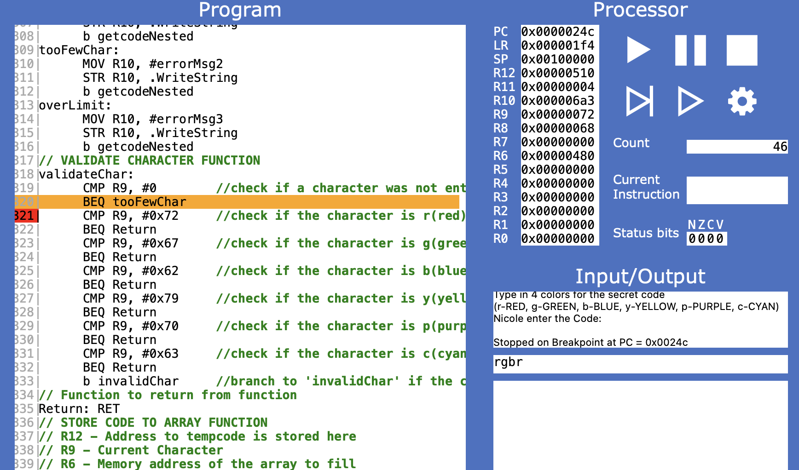
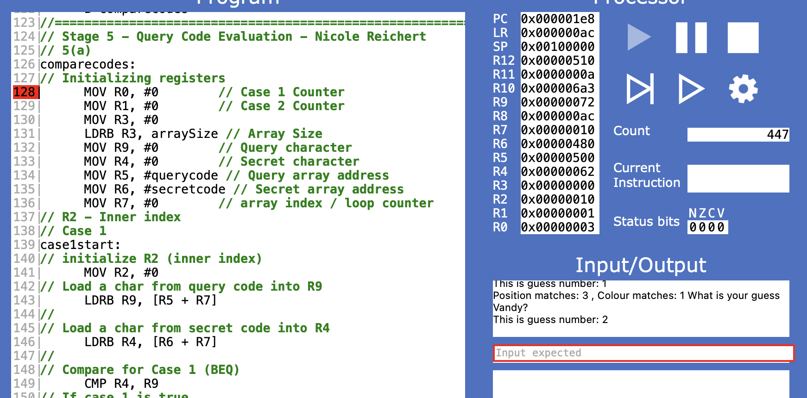

\begin{titlepage}
\begin{center}

\textbf{COS10031 Computer Technology}

\vspace{0.5cm}

\textbf{Assignment 3: ARMLite Mastermind Game}

\vspace{2.5cm}

\textbf{8:30am Tuesday, 10:30am Wednesday}

\textbf{with Dr. Sourabh Dani}

\vspace{2.5cm}

\textbf{Nicole Reichert (100589839)}

\textbf{Marcus Mifsud (105875038)}

\textbf{Vandy Aum (105715697)}

\textbf{Luke Byrnes (7194587)}

\vspace{2.5cm}

Due: 18 May 2025

\textbf{Diploma IT - Swinburne College}

\end{center}
\end{titlepage}

\tableofcontents

# Mastermind Assembly Game

## Program Overview

This program replicates gameplay of the Mastermind boardgame in Assembly using the ARMLite assembly utility.

## Key Functions

### Stage 1 (`stage1.txt`)

Stage 1 makes use of the following functions:

```asm {filename="stage1.txt"}
// Program functions:
    // Display whoIsCodeMaker Query prompt:
    whoIsCodeMaker: .ASCIZ "Codemaker is: "
    // Store block of memory of 128 bytes to store the string
    codeMaker: .BLOCK 128
    // Display whoIsCodeMaker Query prompt:
    whoIsCodeBreaker: .ASCIZ "\nCodebreaker is: "
    // Store block of memory of 128 bytes to store the string
    codeBreaker: .BLOCK 128
    // Display guessLimit Query prompt:
    whatIsGuessLimit: .ASCIZ "\nGuess Limit: "
```

{width="400"}

### Stage 2 (`stage2.txt`)

Stage 2...

```asm {filename="stage2.txt"}
1234
```

{width="600"}

### Stage 3 (`stage3.txt`)

Stage 3...

```asm {filename="stage3.txt"}
1234
```

{width="400"}

### Stage 4 (`stage4.txt`)

Stage 4...

```asm {filename="stage3.txt"}
1234
```

{width="400"}

### Stage 5a (`stage5a.txt`)

Stage 5a...

```asm {filename="stage3.txt"}
1234
```

{width="400"}

### Stage 5b (`stage5b.txt`)

Stage 5b...

```asm {filename="stage5b.txt"}
1234
```

{width="400"}

## Assumptions


## Unresolved Problems


